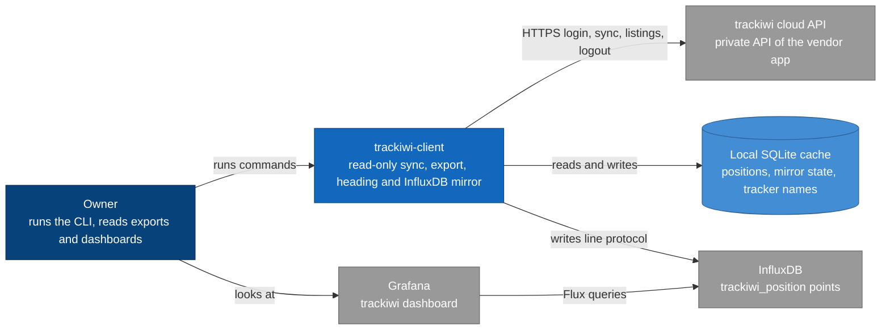
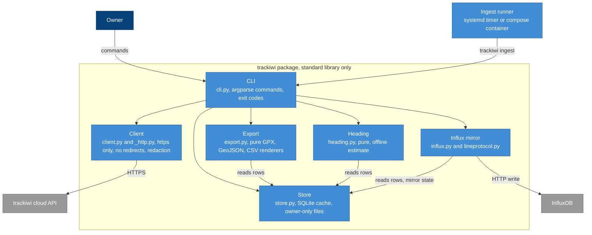
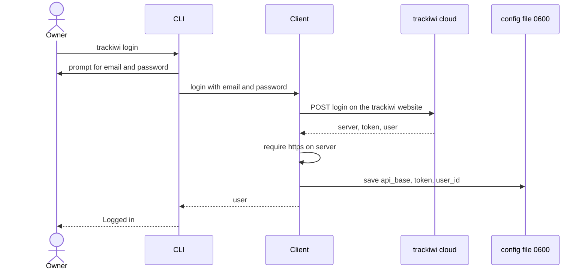
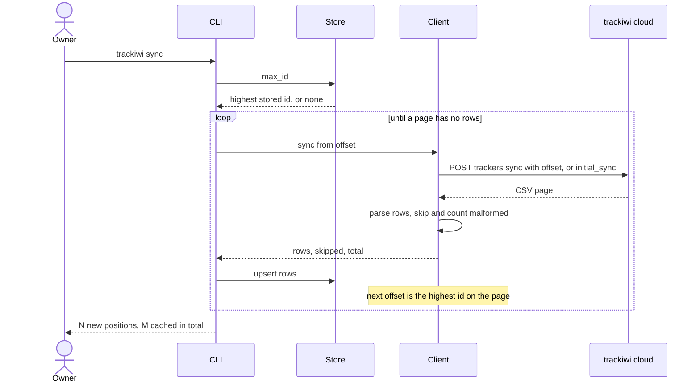
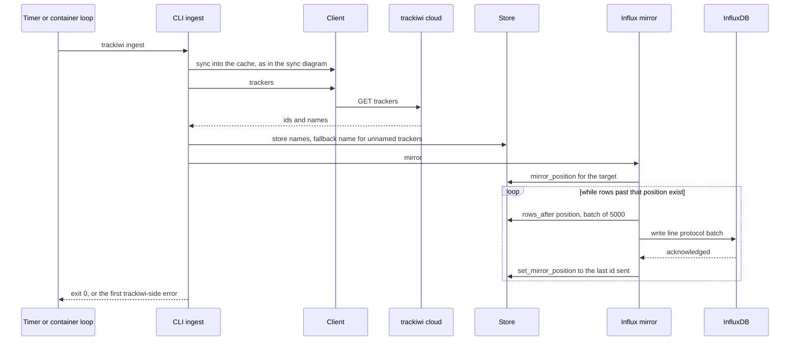
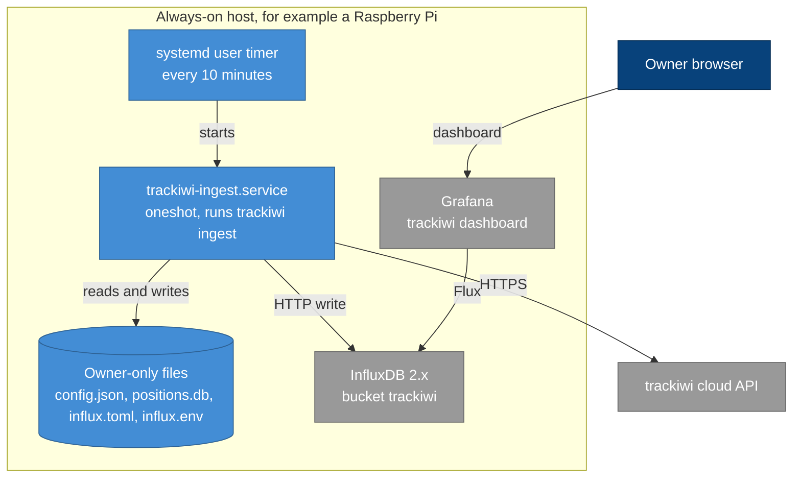

# Architecture

This page follows the arc42 section layout and draws with C4-styled Mermaid diagrams. Every
claim about behaviour links to a requirement (each is traced to a verifying test in
{doc}`traceability`) or names the module that implements it. Where a section has nothing true
and useful to add, it says so.

## 1. Introduction and goals

trackiwi-client pulls the positions of a personal trackiwi GPS tracker out of the vendor's cloud
and keeps them on hardware the owner controls: a local SQLite cache, exports as GPX, GeoJSON or
CSV, and optionally an InfluxDB bucket that Grafana draws. It is unofficial and unaffiliated.

| Goal | What it means |
|---|---|
| Read-only | Against the trackiwi API, the only request that changes state is the logout `DELETE /api/v2/session`. {need}`REQ_READONLY` |
| Private by construction | The token and the cache are the most sensitive things it handles: owner-only files, no token in output, no private data in the repository. {need}`REQ_TOKEN_NEVER_LOGGED`, {need}`REQ_CACHE_MODE_0600`, {need}`REQ_NO_PRIVATE_DATA` |
| Resumable | Any interruption is repaired by running the same command again. {need}`REQ_SYNC_RESUME`, {need}`REQ_MIRROR_RESUME` |
| Nothing to install | The package imports only the standard library. {need}`REQ_ZERO_DEPS` |
| Honest data | A row that cannot be trusted is skipped and counted, never stored or guessed. {need}`REQ_MALFORMED_SKIP` |

## 2. Constraints

- There is no published trackiwi API. The client talks to the private API the vendor's app uses,
  which can change without notice. Behaviour was verified against a live account; the opt-in
  live contract test (`TRACKIWI_LIVE=1`) is the way to re-check it.
- Python 3.11 or newer, standard library only at runtime. Documentation and test tooling are
  development dependencies only.
- The API base is never hardcoded: it comes from the login response and must be `https://`.
  {need}`REQ_API_BASE_FROM_LOGIN`, {need}`REQ_API_BASE_HTTPS`
- No deployment specifics in this repository (no real hostnames, IPs, credentials, tracker ids
  or coordinates). {need}`REQ_PORTABLE_CONFIG`, {need}`REQ_NO_PRIVATE_DATA`
- The token is stored in plaintext in the config file, mode `0600`. There is no keychain
  integration yet (see section 11).

## 3. Context and scope

Outside the boundary: the trackiwi cloud (not ours, may change), InfluxDB and Grafana (the
owner's own, optional). The cache is inside: it is the boundary between fetching and everything
else, and the buffer that lets the mirror survive an outage.

## 4. Solution strategy

| Problem | Approach |
|---|---|
| The API can change or lie | Parse defensively, skip and count bad rows, fail loudly on a page that makes no progress. {need}`REQ_SYNC_FAIL_LOUD`, {need}`REQ_SYNC_PAST_MALFORMED` |
| Runs get interrupted | Offset-based sync from the highest stored id; per-target mirror position stored after each acknowledged batch. No retry logic: re-running is the retry. |
| The token must not leak | One redaction helper for every message built from server text; tokens only via stdin; owner-only files. {need}`REQ_TOKEN_NEVER_LOGGED` |
| Redirects can carry the token away | A shared opener refuses every redirect, and a 3xx is an error. {need}`REQ_NO_REDIRECTS` |
| It must not change the vendor account | No write code exists beyond logout; the app-command response header is ignored. {need}`REQ_READONLY`, {need}`REQ_IGNORE_APP_COMMAND` |
| Foreign exceptions look like bugs | Converted to `TrackiwiError` at each module boundary, so `main()` catches only the project's exceptions. |
| Requirements must stay true | Each requirement is a `sphinx-needs` object traced to a test; the docs build fails under `-W` if one is unverified. |

## 5. Building blocks

| Block | Module | Responsibility |
|---|---|---|
| CLI | `trackiwi/cli.py` | Parses commands, maps `AuthError` to exit 2 and `TrackiwiError` to exit 1, writes exports atomically. Catches nothing else, so bugs are not presented as user mistakes. |
| Client | `trackiwi/client.py`, `trackiwi/_http.py` | Login, logout, listings, the paged position sync, the stored session. Insists on an `https://` base, refuses redirects, scrubs the token from every error. |
| Store | `trackiwi/store.py` | The SQLite cache: `positions`, `mirror_state` (the per-target last id) and `tracker_names`. Creates files at `0600` in a `0700` directory; tells a locked cache from a corrupt one. |
| Export | `trackiwi/export.py` | Pure renderers, one track per tracker. No I/O. |
| Heading | `trackiwi/heading.py` | Pure, offline estimate of the parked heading from the last two moving fixes. Never creates the cache. |
| Influx mirror | `trackiwi/influx.py`, `trackiwi/lineprotocol.py` | Config resolution, version detection, the write and check calls, and `mirror`, the loop that sends rows past the stored position in batches. The only module that talks to InfluxDB. |
| Ingest runner | `deploy/systemd/`, `deploy/ingest/Dockerfile` | Not code in the package: a timer or a loop that runs `trackiwi ingest`. |

`influx.py` and `client.py` never import each other; the exceptions live in
`trackiwi/__init__.py` so `client` and `store` never import each other either.

## 6. Runtime view

### Login

The login request goes to the vendor's website; the API base for everything after it is the
`server` field of the response, checked for `https://` before it is stored. The password is
never stored. A response that lacks a field is an error that does not echo the body, which could
contain the token. {need}`REQ_API_BASE_FROM_LOGIN`, {need}`REQ_API_BASE_HTTPS`,
{need}`REQ_CONFIG_MODE_0600`

### Sync (offset-based, resumable)

The offset is exclusive: a page requested at offset N holds ids greater than N. The loop stops
when a page holds no rows at all. It fails loudly instead of looping if a page has skipped rows
but not one readable id, or if the highest id does not pass the offset just requested. A
malformed row, even the newest one, is skipped and counted and the offset moves past it. Each
page is written before the next is requested, so an interruption loses nothing and the next run
starts from `max_id`. `sync --full` ignores the stored id and sends `initial_sync`.
{need}`REQ_SYNC_RESUME`, {need}`REQ_SYNC_OFFSET_EXCLUSIVE`, {need}`REQ_SYNC_FAIL_LOUD`,
{need}`REQ_SYNC_PAST_MALFORMED`

### Ingest and the InfluxDB mirror

The three steps fail independently: the push runs even if the sync or the name refresh failed,
and the first trackiwi-side error decides the exit code. The mirror position is stored only after
InfluxDB acknowledges a batch (a 2xx, or a 4xx partial write for points beyond the bucket's
retention), so a failure leaves the failed batch and everything after it for the next run. A point
is a pure function of its row, so sending twice overwrites rather than duplicates. A tracker with
no stored name stops the mirror before it sends anything. {need}`REQ_MIRROR_RESUME`,
{need}`REQ_MIRROR_IDEMPOTENT`, {need}`REQ_MIRROR_FALLBACK_NAME`, {need}`REQ_INFLUX_WRITE_SCOPE`

## 7. Deployment

The package needs no server. The reference deployment is a small always-on Linux host (for
example a Raspberry Pi) that runs `trackiwi ingest` from a systemd user timer every ten minutes
and feeds an InfluxDB and Grafana on the same machine or the same network. The turnkey
alternative is `deploy/docker-compose.yml`.

- The unit reads the token for InfluxDB from an optional `influx.env` (or a `token_file`), never
  from `influx.toml`.
- In the compose stack, ingest runs as a loop in a container, keeps its session and cache on a
  volume, and receives a token scoped to read and write on the one bucket, never the operator
  token. Published ports bind to `127.0.0.1` unless a bind address is set on purpose.
  {need}`REQ_DEPLOY_LEAST_EXPOSURE`
- Everything committed under `deploy/` and `examples/` is a placeholder. How a specific machine
  is deployed (its host, its secrets, its Grafana) lives in the repository that deploys it; for
  the author's camper box that is [buspi-config](https://github.com/ckeller42/buspi-config).
  {need}`REQ_PORTABLE_CONFIG`

The step-by-step is in {doc}`howto-ingest`.

## 8. Crosscutting concepts

- **Errors and exit codes.** `TrackiwiError` for any failure talking to trackiwi, `AuthError`
  for a rejected or missing session (exit 2). Transport failures, including a timeout while
  reading a response, become `TrackiwiError` in `_http.send`, never a raw `OSError`.
- **Secrets.** The token is never logged or printed; error bodies pass through `_http.redact`
  and `Client._api` scrubs the token from any error beneath it. {need}`REQ_TOKEN_NEVER_LOGGED`,
  {need}`REQ_INFLUX_TOKEN_REDACT`. A stored token must always be removable, even from a config
  `load` refuses. {need}`REQ_TOKEN_REMOVABLE`
- **File modes.** Config, cache and exports are created at their final mode (`0600`, in `0700`
  directories) and a widened mode is narrowed on load. {need}`REQ_CONFIG_MODE_0600`,
  {need}`REQ_CACHE_MODE_0600`, {need}`REQ_EXPORT_ATOMIC`
- **Time.** Every timestamp is epoch seconds UTC after parsing; `normalize_epoch` takes the sync
  CSV integer, `epoch_from_iso` takes the ISO string of the trackers endpoint, and they are kept
  apart on purpose. {need}`REQ_FIX_AT_SECONDS`. Units of the other fields are in
  {doc}`reference/units`.
- **Read-only commands never create the cache.** `export`, `heading` and `purge` touch the
  database only if it exists; `purge` deletes without opening it. {need}`REQ_PURGE_DELETES`,
  {need}`REQ_PURGE_NOT_ON_LOCK`
- **Traceability.** Requirements, their tests and the API are in {doc}`requirements`,
  {doc}`traceability` and {doc}`api`.

## 9. Decisions

Decisions that shaped the design, with the rule that now enforces each. Dated design specs live
locally and are not part of the repository.

| Decision | Reason | Enforced by |
|---|---|---|
| Standard library only | Nothing to install on a small host, a small supply-chain surface for a tool that holds a location token. | {need}`REQ_ZERO_DEPS` |
| Read-only client | A bug must not be able to disarm an alarm, publish a share or edit a tour. `test_alarm` and the trailing-slash item routes are never called. | {need}`REQ_READONLY` |
| API base from the login response, https only | The server decides where the API lives, and a plain-HTTP base would send the bearer token in cleartext. | {need}`REQ_API_BASE_FROM_LOGIN`, {need}`REQ_API_BASE_HTTPS` |
| No redirects | urllib would copy the token onto the redirected request, and a login page would read as a successful empty answer. | {need}`REQ_NO_REDIRECTS` |
| Ignore the `trackiwi-app-command` header | The official app executes it; this client never acts on server instructions. | {need}`REQ_IGNORE_APP_COMMAND` |
| Offset sync without retry logic | The offset makes a re-run the retry; a loop would hide failures. | {need}`REQ_SYNC_RESUME` |
| The cache is the buffer for the mirror | InfluxDB or the network can be down; positions wait in SQLite. | {need}`REQ_MIRROR_RESUME` |
| Scoped ingest token, loopback ports | The container never sees the operator token; nothing is exposed by accident. | {need}`REQ_DEPLOY_LEAST_EXPOSURE` |
| Parked heading is an inference | The feed has no compass; the estimate says how far to trust it. | {need}`REQ_HEADING_ESTIMATE`, {need}`REQ_HEADING_STATE` |

## 10. Quality

| Quality | Scenario | How it is checked |
|---|---|---|
| Safety | No code path other than logout changes state at trackiwi. | {need}`REQ_READONLY`, an invariant test in `tests/test_invariants.py` |
| Privacy | A secret or position data is never committed. | Three scanners (gitleaks, detect-secrets, `tools/check_no_private_data.py`) in pre-commit and CI |
| Reliability | Kill a sync or a push at any point, run it again, end with the same state. | {need}`REQ_SYNC_RESUME`, {need}`REQ_MIRROR_RESUME` |
| Maintainability | Strict typing, full docstring coverage, 95 percent test coverage. | `mypy --strict`, `interrogate`, `pytest --cov-fail-under=95` in `tools/ci.sh` and CI |
| Documentation truth | A requirement without a test, or a dangling `:need:` reference, fails the build. | `sphinx-build -b html -W docs docs/_build/html` in CI |

## 11. Risks and technical debt

- **Unofficial API.** It can change without notice. `sync` fails loudly on an unreadable or
  non-advancing page, and the live contract test (`TRACKIWI_LIVE=1`, never in CI) is the
  early-warning check.
- **Unverified shapes.** The `markers` and `shares` endpoints answered with empty lists on the
  account they were checked against, so their field names are expectations. `fix_timezone` is an
  integer of unconfirmed meaning (nothing depends on it).
- **Plaintext token.** The session token is readable by any process of the same user and is swept
  into backups. Moving it into the macOS Keychain is the recommended upgrade and is not done.
- **Location in API responses.** The `trackers` and `alarms` responses hold geofence and event
  coordinates. The commands print none, but the responses themselves deserve the care of the cache.
- **Heading is an estimate.** A vehicle that reversed into its spot points the other way and
  nothing in the data can tell.

## 12. Glossary

| Term | Meaning |
|---|---|
| Tracker | A GPS device on the trackiwi account, identified by an integer id. |
| Position, fix | One reported location row of a tracker, with a server id and a `fix_at` time. |
| Offset | The id after which the next sync page starts; exclusive. |
| Cache | The local SQLite database of positions. |
| Mirror | The step that sends cached positions to InfluxDB. |
| Mirror position | The highest id acknowledged by one InfluxDB target, stored per target in `mirror_state`. |
| Ingest | `sync`, refresh tracker names, then mirror: what a timer runs. |
| Requirement | A `sphinx-needs` object with a `REQ_` id, traced to its verifying tests. |
